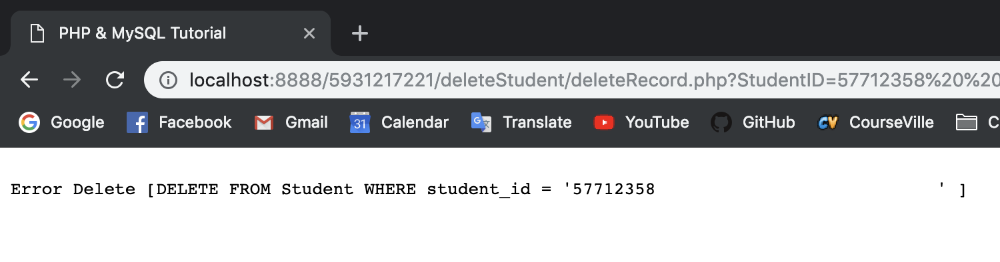
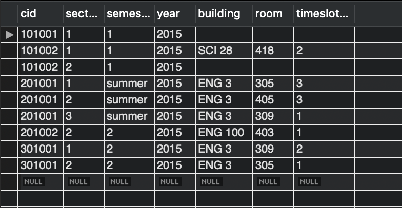

# Lab07

**Jakpat Mingmongkolmitr 5931217221**

## 3


<div style="page-break-after: always;"></div>

## 4


<div style="page-break-after: always;"></div>

## 5

### Before adding a new Professor


### After adding a new Professor


<div style="page-break-after: always;"></div>

## 6

> Change the section of student with student ID 57723547 for course 101002 semester 1/2015, from section 1 to section 2, using your script in web browser.

### Before editing a record


### After editing a record


<div style="page-break-after: always;"></div>

## 7

```sql
DELETE FROM `REGISTRATION_DB`.`Student` WHERE (`student_id` = '57712358');
```

> Error Code: 1451. Cannot delete or update a parent row: a foreign key constraint fails (`REGISTRATION_DB`.`Takes`, CONSTRAINT `takes_ibfk_1` FOREIGN KEY (`student_id`) REFERENCES `Student` (`student_id`))




<div style="page-break-after: always;"></div>

## 8


### Before


### After



