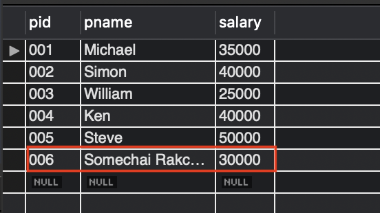
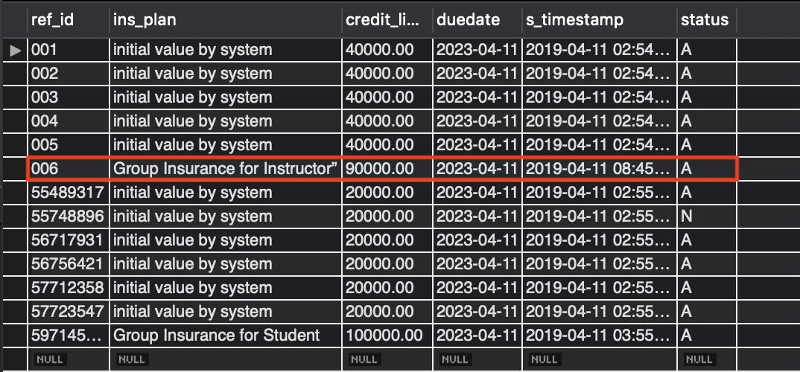
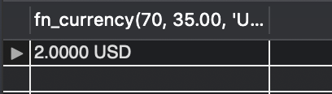
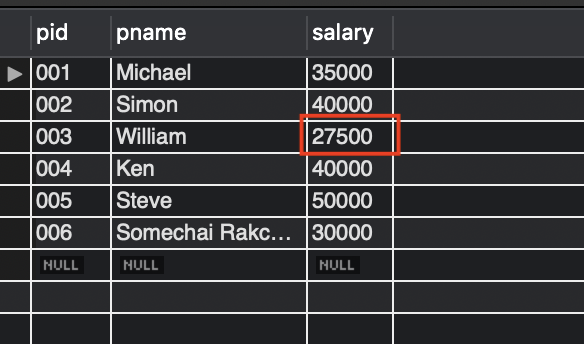
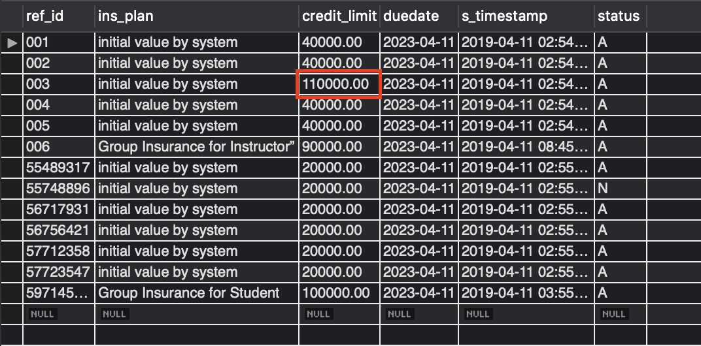
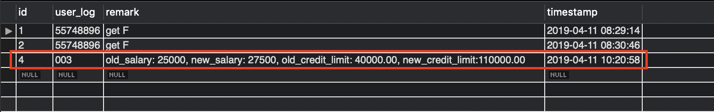

# Lab08

**Jakpat Mingmongkolmitr 5931217221**

## 4.1 Create trigger (2 points)

> Each insertion of professor information, the data are inserted into not only professor table but also into faculty_insurance table that credit_limit value is calculated from 300% of his/her salary and ins_plan is ”Group Insurance for Instructor”.

### Creating trigger command

```sql
CREATE TRIGGER new_professor_added
AFTER INSERT ON Professor
FOR EACH ROW
    INSERT INTO faculty_insurance (ref_id,
        ins_plan, credit_limit, duedate, s_timestamp, status)
    VALUES (new.pid, "Group Insurance for Instructor”", new.salary * 3,
        DATE_ADD(SYSDATE(),INTERVAL 4 YEAR), SYSDATE(), 'A');
```

### Testing command

```sql
INSERT INTO Professor (pid, pname, salary)
VALUES ('006','Somechai Rakchad','30000');

SELECT * FROM Professor;
SELECT * FROM faculty_insurance
```




<div style="page-break-after: always;"></div>

## 4.2 Create function (2 points)

> Convert the number declared in a numerical data type to other currencies using function named “fn_currency(input_number, exchange_rate, currency_name)” and return the result as string.

### Creating function command

```sql
DELIMITER $$
CREATE FUNCTION fn_currency(input_number decimal,
    exchange_rate decimal, currency_name varchar(30))
RETURNS varchar(50) DETERMINISTIC
BEGIN
    DECLARE fullcurrency varchar(50);
    SET fullcurrency = CONCAT(input_number / exchange_rate, ' ', currency_name);
    RETURN fullcurrency;
END$$
DELIMITER ;
```

### Testing command

```sql
SELECT fn_currency(70, 35.00, 'USD');
```



<div style="page-break-after: always;"></div>

## 4.3 Create data stored procedure (6 points)

> Update salaryof all professors who earns salary less than 30,000 up to 10% and update credit limit of insurance up to 400 % of new salary and alsoinsert log into system_log table that stores the old salary, new salary,old credit limit and new credit limit. Finally, the data stored procedure has to print the name, old salary, new salary and credit limit of all professor information that are updated.

### Create data stored procedure command

```sql
DELIMITER $$
CREATE PROCEDURE Proc_cal_professor_upvel()
DETERMINISTIC
BEGIN
    if(SELECT pid FROM Professor WHERE salary < 30000)>0 THEN
        CREATE TEMPORARY TABLE IF NOT EXISTS TMP_PROFESSOR(
            PID varchar(16),
            old_salary int(11) DEFAULT NULL,
            new_salary int(11) DEFAULT NULL,
            old_credit_limit decimal(10,2) DEFAULT NULL,
            new_credit_limit decimal(10,2) DEFAULT NULL
        );
        TRUNCATE TABLE TMP_PROFESSOR;

        INSERT INTO TMP_PROFESSOR (PID, old_salary, new_salary,
            old_credit_limit, new_credit_limit)
        SELECT pid, salary, salary * 1.1, credit_limit, salary * 1.1 * 4
        FROM Professor p
        INNER JOIN faculty_insurance ins ON p.pid = ins.ref_id
        WHERE salary < 30000;

        UPDATE Professor p
        INNER JOIN TMP_PROFESSOR tmp ON p.pid= tmp.PID
        SET salary = tmp.new_salary;

        UPDATE faculty_insurance ins
        INNER JOIN TMP_PROFESSOR tmp ON ins.ref_id= tmp.PID
        SET credit_limit = tmp.new_credit_limit;

        INTO system_log (user_log, remark, timestamp)
        SELECT
            PID,
            CONCAT("old_salary: ", old_salary, ", new_salary: ", new_salary,
                ", old_credit_limit: ", old_credit_limit,
                ", new_credit_limit: ", new_credit_limit) as remark,
            SYSDATE()
        FROM TMP_PROFESSOR;

        SELECT * from Professor WHERE pid in (SELECT PID FROM TMP_PROFESSOR);
    ELSE
        SELECT ' There is no professor those salary less than 30000';
    END IF;
END$$
DELIMITER ;
```

### Testing command

```sql
CALL Proc_cal_professor_upvel();
SELECT * from Professor;
SELECT * from faculty_insurance;
SELECT * from system_log;
```

#### Professor Table

Change from `25000` to `27500`


#### faculty_insurance Table

Change from `4000.00` to `110000.00`



#### system_log Table

New system_log record added


